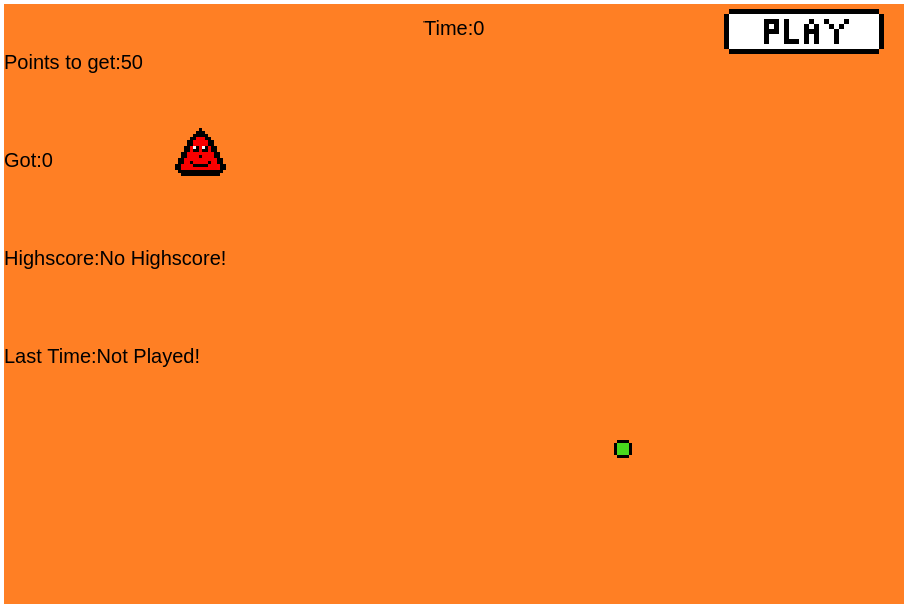

# Get50

Get50 is a small Phaser based game. It is hosted on Github Pages but the phaser.js library is just a plain js library, so it can just be started by opening the index.html in a browser.

 

This was one of the first times I coded something. It was what got me hooked on Javascript and Webdevelopment. Even though it was a game. The CSS seem to be a bit broken on Github Pages but I'm not going to fix it.
